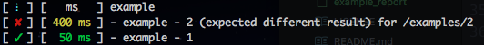

# iREST

[ ](https://codeship.com/projects/167341)
[](http://godoc.org/github.com/bsedg/irest)
[](https://goreportcard.com/report/github.com/bsedg/irest)
[](https://opensource.org/licenses/MIT)

Integration testing framework for creating for RESTful APIs with golang.


```
// Example using iREST to test an API.

import (
    "net/http"

    "github.com/bsedg/irest"
)

func main() {
    loginBase := &irest.Endpoint{Path: "/login", Method: http.MethodPost}
	getExample := &irest.Endpoint{Path: "/examples/%d", Method: http.MethodGet}
	createExample := &irest.Endpoint{Path: "/examples", Method: http.MethodPost}

	t := irest.NewTest("Example")
	// Sets default headers to use throughout tests.
	t.AddHeader("name", "value").AddHeader("name", "value").AddHeader("name", "value")
	ex := &example{}
	t.NewEndpointsTest("Example",
		// TODO(bsedg): only execute if previous test passes
		loginBase.Use("api/", nil).MustStatus(http.StatusOK).Do().SaveHeader("x-authentication", "AUTH"),
		// TODO(bsedg): execute request on last Use before Must...
		createExample.Use("api/", ex).UseHeader("AUTH", "x-authentication").Do().MustStatus(http.StatusCreated).ParseResponseBody(ex),
		getExample.Use("api/", nil, ex.ID).UseHeader("AUTH", "x-authentication").Do().MustStatus(http.StatusOK),
	)

    r := irest.NewColoredCommandLineReport(t)
	r.PrintResults()
}

```

## Development

Add any needed tests, then run the tests to make sure nothing breaks:

`go test ./...`

### Running the example

Build the binary:

`go build cmd/example_report/example_report.go`

Run the example:

`./example_report`



### Issues, bugs, feature requests

Create a new issue for any bug or feature request. If a bug is found or unexpected behavior, create an issue that clearly outlines what was expected and what actually happened. Design proposals of feature requests are welcomed as well.
